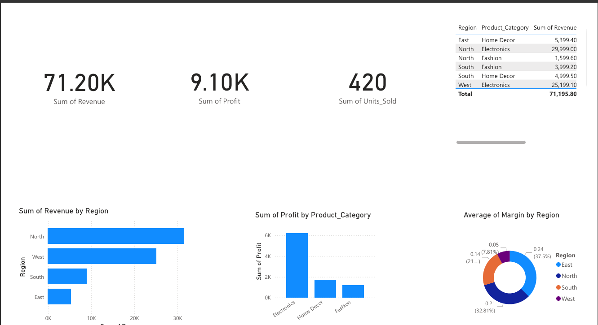

# 🛒 Retail Sales ETL & KPI Dashboard Project

## 🚀 Project Summary

This end-to-end **ETL + KPI Dashboard project** simulates a real-world retail reporting pipeline.  
It transforms raw transactional data using **Python (Pandas)** into business-ready KPIs and visualizes insights via **Power BI**.

The entire workflow mirrors reporting tasks I performed at Wipro — now rebuilt using modern tools and automation.  
The dashboard enables decision-makers to monitor performance, identify low-margin regions, and prioritize high-potential categories.

---

## 📌 Key Business Objectives

- 🧹 Clean and transform raw sales data using Python
- 📊 Calculate KPIs: **Revenue, Profit, Margin, Units Sold**
- 🌍 Analyze by **Region** and **Product Category**
- 📈 Visualize actionable trends via **Power BI Dashboard**

---

## 🧰 Tools & Technologies

| Tool              | Purpose                                  |
|-------------------|------------------------------------------|
| Python + Pandas   | Data cleaning, transformation, KPI calc  |
| Power BI          | Dashboard for business stakeholders      |
| Jupyter Notebook  | ETL logic + documentation                |
| GitHub            | Version control + project showcase       |

🔁 This approach automates reporting previously done via Excel/SAS in my Wipro role — now scalable with Python.

---

## 📈 Sample Data Dictionary

| Column           | Description                             |
|------------------|-----------------------------------------|
| `Date`           | Transaction date                        |
| `Region`         | Sales region (East, West, etc.)         |
| `Product_Category` | Electronics, Fashion, Home Decor     |
| `Units_Sold`     | Quantity sold                           |
| `Unit_Price`     | Price per unit                          |
| `Cost`           | Total cost for the transaction          |
| `Revenue`        | Units × Unit Price                      |
| `Profit`         | Revenue − Cost                          |
| `Margin`         | Profit ÷ Revenue                        |

---

## ⚙️ ETL Process Flow

1. **Extract** raw CSV file (`raw_retail_sales_data.csv`)
2. **Transform** data using Pandas:
   - Type conversion, column cleanup
   - Calculate `Revenue`, `Profit`, `Margin`
3. **Load** into cleaned CSV & summary report for Power BI

---

## 📊 Power BI Dashboard Overview

### ✅ Features:
- High-level KPIs: Total Revenue, Profit, Units, Margin %
- Bar charts: Revenue by Region, Margin by Category
- Line chart: Daily Revenue Trend
- Interactive summary table
- Slicers for Region & Category
- Business insights summary for decision-makers

---

## 🧠 Key Business Insights

- 📉 **West region** shows high revenue but **lowest margin** — optimization opportunity
- 💡 **Fashion** maintains strong and stable margins (~30.6%) — potential to scale
- 📈 **Daily trends** show consistent Q1 performance across India

---

## 🧪 Real-World Impact

> At Wipro, I created and validated 100+ recurring reports across payroll and data ops.  
> This project reflects how I now **automate** that process using Python + Power BI, reducing manual effort and error rates.

It shows I can build **full-cycle reporting systems**:  
from raw data → cleaned KPIs → actionable dashboards.

---

## 📁 Folder Structure

📁 Folder Structure
Retail_Sales_ETL_Project/
│
├── data/
│   ├── raw_sales_data.csv
│   └── cleaned_sales_data.csv
│
├── output/
│   └── summary_report.csv
│
├── visuals/
│   ├── dashboard.pbix
│   └── dashboard_screenshot.png
│
|
├── scripts/
├── sales_etl_pipeline.ipynb
|
├── requirements.txt
└── README.md

---

## 💼 Let’s Connect

📬 Looking for a Python-powered analyst with enterprise reporting experience?  
I’m available for interviews now.  
📎 [LinkedIn Profile](https://www.linkedin.com/in/ashwani-kumar-data-analyst)
