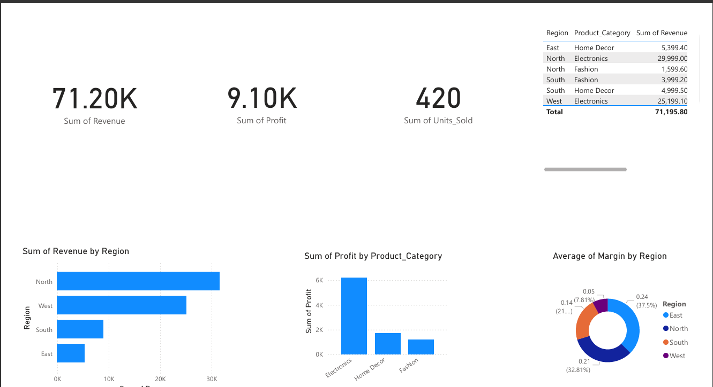

# 🛒 Retail Sales ETL & KPI Dashboard Project

## 🚀 Project Summary

This is a complete end-to-end **ETL + KPI Dashboard** project simulating a retail sales pipeline.  
Built using **Python (pandas)** and **Power BI**, the project transforms raw CSV data into business-ready insights through data cleaning, KPI calculations, and rich dashboard visualizations.

---

## 📌 Objective

- Load and process raw transactional data
- Clean & transform using Python (ETL)
- Compute KPIs: Revenue, Profit, Margin, Units Sold
- Aggregate by Region and Product Category
- Visualize in Power BI for executive decision-making

---

## 🧰 Tools & Technologies

| Tool        | Purpose                           |
|-------------|-----------------------------------|
| Python      | Data transformation & cleaning    |
| pandas      | DataFrame manipulation            |
| Power BI    | Visual dashboard for KPIs         |
| GitHub      | Project versioning and showcase   |
| Jupyter Notebook | Code documentation & workflow |

---

📁 Folder Structure
Retail_Sales_ETL_Project/
│
├── data/
│   ├── raw_sales_data.csv
│   └── cleaned_sales_data.csv
│
├── output/
│   └── summary_report.csv
│
├── visuals/
│   ├── dashboard.pbix
│   └── dashboard_screenshot.png
│
|
├── scripts/
├── Retail_Sales_ETL_KPI_Analysis.ipynb
|
├── requirements.txt
└── README.md

---

## 📈 Data Dictionary

| Column           | Description                             |
|------------------|-----------------------------------------|
| `date`           | Date of transaction                     |
| `region`         | Region where the sale occurred          |
| `product_category` | Product category                      |
| `units_sold`     | Number of units sold                    |
| `unit_price`     | Price per unit                          |
| `cost`           | Total cost of the transaction           |
| `revenue`        | units_sold × unit_price                 |
| `profit`         | revenue − cost                          |
| `margin`         | profit / revenue                        |

---

## ⚙️ ETL Process Flow

1. Extract raw sales data from CSV
2. Transform:
   - Rename & clean columns
   - Convert data types
   - Calculate Revenue, Profit, Margin
3. Load final output as:
   - Cleaned CSV
   - Aggregated summary report

---

## 📘 Jupyter Notebook

👉 [Retail Sales ETL + KPI Analysis Notebook](Retail_Sales_ETL_KPI_Analysis.ipynb)

The notebook includes:
- Data loading and transformation
- Groupby aggregations
- Output file generation
- Logging and error handling

---

## 📊 Power BI Dashboard

Visual KPIs displayed in the dashboard:

- Total Revenue, Profit, Units Sold (Cards)
- Revenue by Region (Bar chart)
- Profit by Product Category (Column chart)
- Average Margin by Region (Donut chart)

🔗 [Download Power BI File (.pbix)](visuals/dashboard.pbix)

---

## 🧾 How to Run
1. Clone the repository
git clone https://github.com/Swagy026/Retail_Sales_ETL_Project.git
cd Retail_Sales_ETL_Project

2. Install dependencies
pip install -r requirements.txt

3. Run the ETL Notebook
jupyter notebook Retail_Sales_ETL_KPI_Analysis.ipynb

💡 Key Business Insights
💰 Highest revenue from North region
📦 Most profitable category: Electronics
⚠️ West region has lowest profit margin

🔮 Future Enhancements
-Automate ETL with Apache Airflow
-Store data in cloud (GCS / S3)
-Push data into BigQuery
-Embed Power BI into web dashboard
-Add unit testing & validation

👨‍💻 Author
Ashwani Chaudhary
Data Engineer / Analyst 
